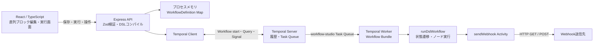
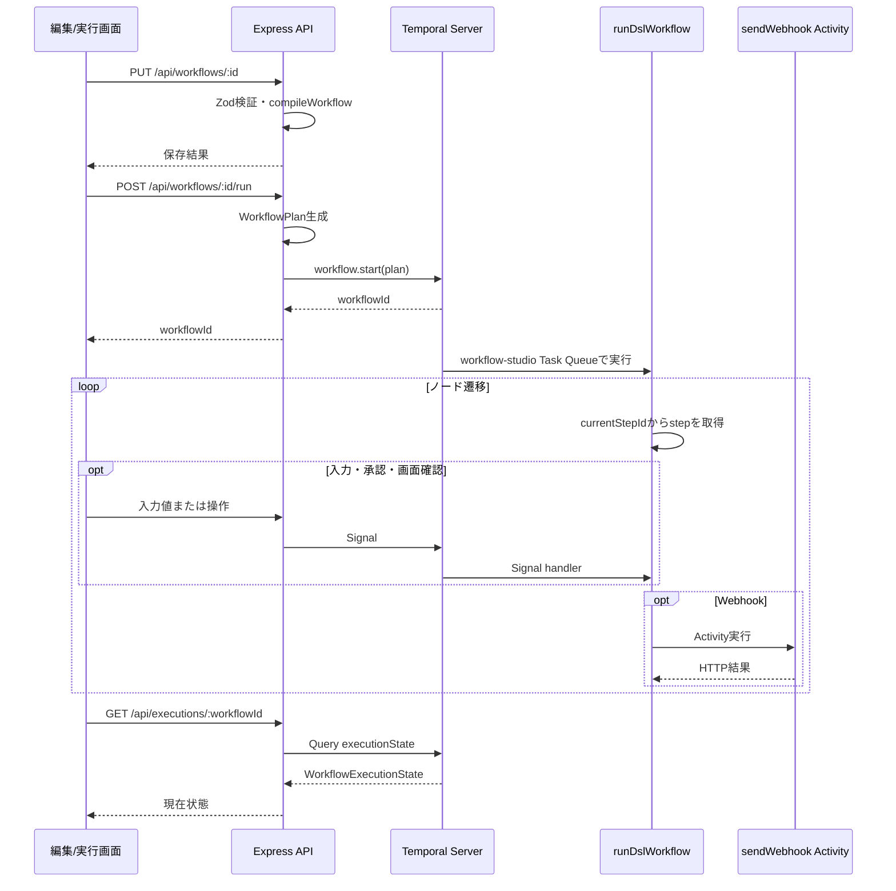

# Temporal DSL 実装設計書

## 1. 目的と対象範囲

この文書は、ワークフロー定義が編集画面からAPIへ送られ、検証・コンパイルを経てTemporal上で実行されるまでの構造を説明する。特にDSLのノード/エッジ形式、実行計画への変換、WorkflowとActivityの責務分担を扱う。

このリポジトリはMVPであり、ワークフロー定義はAPIプロセスのメモリ内に保存する。プロセス再起動後も定義を保持する永続ストア、認証・認可、テナント分離、実行履歴UIは実装していない。

## 2. システム構成



| コンポーネント | 実装 | 責務 |
| --- | --- | --- |
| 編集画面 | `client/src/App.tsx` | ノード設定、直列表示、条件分岐と戻り先の編集、保存、Workflow起動 |
| 実行画面 | `client/src/ExecutionView.tsx` | 状態Queryの定期取得、入力・承認・画面確認操作、画面表示 |
| API | `server/src/api.ts` | REST、Zod検証、定義保存、WorkflowPlan生成、Temporal Client経由の開始・Query・Signal |
| DSL | `server/src/dsl.ts` | WorkflowDefinitionの型・スキーマ、グラフ検証、WorkflowPlanへのコンパイル |
| Workflow | `server/src/workflows.ts` | Temporal上での待機、シグナル処理、ノード遷移と条件評価 |
| Worker | `server/src/worker.ts` | Temporal接続、Workflow Bundleの読込、Task Queueのpoll、Activity登録 |
| Activity | `server/src/activities.ts` | Workflow外の副作用であるWebhook HTTP送信 |

APIとWorkerは同じTask Queueを使う。既定値は`workflow-studio`。Temporal Serverは開発時に`temporal server start-dev`で別プロセスとして起動する。

## 3. DSLのデータモデル

### 3.1 WorkflowDefinition

編集画面と保存APIは、ノード配列と接続エッジ配列からなる`WorkflowDefinition`をやり取りする。保存形式はグラフだが、画面はグラフキャンバスではなく、接続をたどった直列ブロック表示である。

```ts
{
  id: string,
  name: string,
  nodes: Array<{
    id: string,
    type: 'trigger' | 'delay' | 'webhook' | 'approval' | 'page' | 'input' | 'condition',
    position: { x: number, y: number },
    data: {
      label: string,
      seconds?: number,
      url?: string,
      method?: 'GET' | 'POST',
      conditionField?: 'inputA' | 'inputB',
      conditionOperator?: string,
      conditionValue?: string
    }
  }>,
  edges: Array<{
    id: string,
    source: string,
    target: string,
    sourceHandle?: string
  }>
}
```

`position`はスキーマ互換用の座標情報で、現在の直列表示と実行順序は座標から決めない。実行順序はエッジをたどって決める。

`sourceHandle`はどの結果の接続かを識別する。

| `sourceHandle` | 接続元 | 意味 |
| --- | --- | --- |
| 省略 | 通常ノード、承認の「はい」 | 次の工程 |
| `ok` | 条件分岐 | 条件成立時の工程 |
| `ng` | 条件分岐 | 条件不成立時の通常工程 |
| `ng-return` | 条件分岐 | 条件不成立時に戻る前工程 |
| `no-return` | 承認 | 「いいえ」の場合に戻る前工程 |

条件ノードは`ok`接続を必須とし、`ng`または`ng-return`のいずれか一方を設定する。承認ノードの`no-return`は任意で、未設定なら「いいえ」は拒否終了となる。戻りエッジは制御用の接続であり、通常の次工程や条件分岐先とは別にコンパイルする。

### 3.2 ノード設定と比較

| ノード種別 | 設定値 | 実行上の動作 |
| --- | --- | --- |
| `trigger` | `label` | 手動開始点。実行ステップ配列には含めない |
| `input` | `label` | `inputA`（空でない文字列）と`inputB`（ASCII数字列）をSignalで受け取る |
| `condition` | `conditionField`, `conditionOperator`, `conditionValue`, `maxReturnCount`（戻り時、1〜100、既定3） | 直近の入力値を比較して接続先を選ぶ |
| `delay` | `seconds`（1〜86400） | Temporal Timerで待機する |
| `webhook` | `url`, `method` | ActivityでHTTP GETまたはPOSTを送信する |
| `approval` | `label`, `maxReturnCount`（戻り時、1〜100、既定3） | 「はい」で通常接続へ進み、「いいえ」は戻りまたは拒否終了 |
| `page` | `url` | 実行画面でURLをiframe表示し、続行Signalまで待つ |

条件演算子は入力フィールドで制限する。入力Aでは`equals`、`not_equals`、`contains`を使う。文字列比較は完全一致または大文字小文字を区別した部分一致。入力Bでは`equals`、`not_equals`、`greater_than`、`greater_or_equal`、`less_than`、`less_or_equal`を使い、比較時に数値化する。入力値と比較値は文字列として保持するため、入力Bの先頭ゼロは表示・受け渡し時に失われない。

### 3.3 DSL例

次の例は、入力が条件NGなら入力工程へ戻り、条件OKなら承認へ進む。承認の「いいえ」も入力へ戻り、「はい」なら画面表示へ進む。

```json
{
  "id": "review-flow",
  "name": "入力確認",
  "nodes": [
    { "id": "start", "type": "trigger", "position": { "x": 0, "y": 0 }, "data": { "label": "開始" } },
    { "id": "input", "type": "input", "position": { "x": 0, "y": 100 }, "data": { "label": "入力" } },
    { "id": "check", "type": "condition", "position": { "x": 0, "y": 200 }, "data": { "label": "数値確認", "conditionField": "inputB", "conditionOperator": "greater_than", "conditionValue": "5" } },
    { "id": "approval", "type": "approval", "position": { "x": 0, "y": 300 }, "data": { "label": "承認" } },
    { "id": "done", "type": "page", "position": { "x": 0, "y": 400 }, "data": { "label": "完了", "url": "http://localhost:5173/demo-pages/welcome.html" } }
  ],
  "edges": [
    { "id": "e1", "source": "start", "target": "input" },
    { "id": "e2", "source": "input", "target": "check" },
    { "id": "e3", "source": "check", "target": "approval", "sourceHandle": "ok" },
    { "id": "e4", "source": "check", "target": "input", "sourceHandle": "ng-return" },
    { "id": "e5", "source": "approval", "target": "done" },
    { "id": "e6", "source": "approval", "target": "input", "sourceHandle": "no-return" }
  ]
}
```

## 4. 検証とコンパイル

`compileWorkflow()`は保存時と実行開始時に呼び出され、定義の不備をWorkflow起動前に検出する。

1. `workflowSchema`がZodでJSONの形・列挙値・必須値を検証する。
2. `compileWorkflow()`が開始ノードは1つか、ID重複がないか、接続先が存在するかを確認する。
3. 通常接続の多重入力、非条件ノードの複数の次工程、条件ノードの接続ハンドル、条件設定を検証する。
4. 開始ノードから通常接続と`ok`/`ng`分岐を深さ優先探索し、一般の循環、到達不能ノード、不完全な条件分岐を拒否する。
5. `ng-return`/`no-return`は通常探索から分離する。戻り先は同じ探索経路上の過去ノードに限り、開始ノード・自分自身・未来のノードは拒否する。条件NGの通常接続と戻り先の同時設定も拒否する。
6. 検証済みノードを`WorkflowPlan`へ変換する。

生成される`WorkflowPlan`は次の実行用インデックスを持つ。

| フィールド | 内容 |
| --- | --- |
| `steps` | triggerを除いた各ノードの実行データ |
| `startStepId` | 開始後に最初に実行する工程ID |
| `nextById` | 通常接続元IDから次工程IDへの対応 |
| `branchesById` | 条件ノードIDからOK/通常NG先への対応 |
| `conditionNgReturnsById` | 条件ノードIDからNG時の戻り先と戻り上限への対応 |
| `approvalNoReturnsById` | 承認ノードIDから「いいえ」の戻り先と戻り上限への対応 |

`steps`配列の並び自体は実行順を定義しない。Workflowは`currentStepId`と上記マップを使って次のノードを選ぶ。これにより、UIの表示順と実行制御を分離している。

## 5. Temporalでの実行



### 5.1 Workflow責務

`runDslWorkflow(plan)`は副作用を直接実行せず、決定的な状態遷移を行う。開始IDを`currentStepId`に設定し、工程を取得して種別ごとの処理後に次のIDを決める。

- 通常工程は`nextById[step.id]`へ進む。
- 条件分岐は入力値を比較し、成立ならOK先、不成立ならNG戻り先があればそこへ、なければ通常NG先へ進む。
- 承認は`approvalDecision`がSignalで設定されるまで待つ。「はい」は通常接続へ進む。「いいえ」は戻り先があればそこへ戻り、なければ`rejected`で終了する。
- 入力は`waiting_input`状態でSignalを待つ。入力ノードへ戻った場合は前回値をクリアして再入力を受け付ける。
- 画面表示は`waiting_page`状態で続行Signalを待つ。
- 待機は`@temporalio/workflow`の`sleep()`を使う。Workerが再起動してもTimerはTemporal履歴から再開される。
- Workflowが外部HTTPを必要とする場合だけ`sendWebhook` Activityを呼び出す。

戻り上限は戻り元ノードごと・Workflow実行ごとに数える。既定値は3回で、1〜100回の範囲で設定できる。設定回数の戻り遷移を許可した後、次の戻り要求で`loop_limit_reached`となり、実行画面に理由を表示して終了する。Workflowは戻り先からその後の工程も再実行するため、Webhookを含む工程へ戻る場合は送信先側の冪等性を考慮する。

### 5.2 Signal・Queryと状態

Workflowは`executionState` Queryと3種類のSignalを登録する。

| 名前 | 用途 | Workflow側の待機 |
| --- | --- | --- |
| `submitInputValues` | `{ inputA, inputB }`を受信 | `waiting_input`のみ受理 |
| `approvalDecision` | `yes`または`no`を受信 | `waiting_approval`のみ受理 |
| `continuePage` | 画面確認後の続行 | `waiting_page`のみ受理 |
| `executionState` | 現在状態のQuery | 実行画面が約1秒間隔で取得 |

`WorkflowExecutionState.status`は`running`、`waiting_delay`、`waiting_input`、`waiting_approval`、`waiting_page`、`rejected`、`loop_limit_reached`、`completed`。待機中は`currentStepId`と`currentStepLabel`を含める。入力値を受け取った後は後続状態にも`inputValues`を含め、再入力待ちでは前回値を含めない。

### 5.3 ActivityとWebhook

`sendWebhook`はWorkflowから分離したActivityである。Activity設定は開始から20秒のタイムアウト、最大3回の試行。実際のfetchは15秒でタイムアウトする。

- POSTは`workflowId`と、取得済みであれば`inputA`/`inputB`をJSON本文に含める。
- GETは`inputA`/`inputB`をクエリパラメーターとして追加する。
- HTTPレスポンスが成功以外ならActivityはエラーにし、Temporalの再試行設定を適用する。

## 6. API

既定のAPI URLは`http://localhost:4000`。CORSは既定で`http://localhost:5173`を許可する。JSONリクエスト本文の上限は256KB。

| メソッド・パス | 用途 |
| --- | --- |
| `GET /api/health` | API応答、Temporalアドレス、保存方式の情報 |
| `GET /api/workflows` | APIメモリ上にある定義一覧 |
| `POST /api/workflows` | IDを含む定義を検証して新規保存 |
| `PUT /api/workflows/:id` | 定義を検証して保存・更新 |
| `POST /api/workflows/:id/run` | 保存済み定義をコンパイルしWorkflowを開始 |
| `GET /api/executions/:workflowId` | `executionState` Queryで状態を取得 |
| `POST /api/executions/:workflowId/input` | 入力を検証し`submitInputValues` Signalを送信 |
| `POST /api/executions/:workflowId/approval` | 承認結果を検証し`approvalDecision` Signalを送信 |
| `POST /api/executions/:workflowId/continue` | `continuePage` Signalを送信 |

定義はAPI起動中のみ保持される。一方、起動済みWorkflowにはコンパイル済み`WorkflowPlan`を引数として渡すため、Workflowの実行履歴・Timer・状態遷移はTemporal Server側で管理される。

## 7. 画面の値受け渡し

入力値は実行画面の状態Queryから表示され、後続ノードにも引き継がれる。画面表示ノードはiframeの`load`後、次のメッセージを送る。

```ts
{
  type: 'workflow-input-values',
  values: { inputA: string, inputB: string }
}
```

ローカルデモページはこの`postMessage`を受け取って表示する。別サイトはiframe内で受信処理を実装する必要がある。外部サイトのCSPや`X-Frame-Options`が埋め込みを禁止する場合、iframeには表示できない。入力値に機密情報を含めないこと。現在はsandbox iframeとの通信のため送信先Originを`*`としている。

## 8. 起動と検証

必要な環境はNode.js、Yarn 1、Temporal CLI。

```powershell
temporal server start-dev
```

別のターミナルでリポジトリルートから実行する。

```powershell
yarn install
yarn dev
```

`yarn dev`はVite、Express API、Temporal Workerを並列起動する。画面は`http://localhost:5173`、APIは`http://localhost:4000`、Temporal UIは通常`http://localhost:8233`、Temporal gRPCは`localhost:7233`。

```powershell
yarn build
yarn lint
```

主な環境変数:

| 変数 | 既定値 | 用途 |
| --- | --- | --- |
| `PORT` | `4000` | Express APIポート |
| `CLIENT_ORIGIN` | `http://localhost:5173` | APIのCORS許可Origin |
| `VITE_API_URL` | `http://localhost:4000` | Clientから接続するAPI |
| `TEMPORAL_ADDRESS` | `localhost:7233` | Temporal gRPCアドレス |
| `TEMPORAL_NAMESPACE` | `default` | Temporal Namespace |
| `TEMPORAL_TASK_QUEUE` | `workflow-studio` | APIとWorker共通のTask Queue |

## 9. 制約と運用上の注意

- 定義ストアはインメモリで、API再起動で消える。
- APIに認証・認可がない。複数ユーザーや本番利用にはそのまま使わない。
- 戻り接続は戻り元ノードごとに最大100回まで設定できる。上限超過時は`loop_limit_reached`でWorkflowを終了する。
- Webhook URLのSSRF対策、秘密情報保管、送信先別認証、監査ログ、レート制限は未実装。
- 条件分岐の結果経路の合流と並列実行は未対応。
- 入力値やWorkflow引数はTemporal履歴に含まれる可能性があるため、機密情報の取り扱いに注意する。
- Workflowコードを変更した後はWorkerを再起動し、新しいWorkflow Bundleがロードされたことを確認する。
